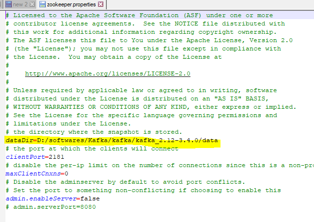
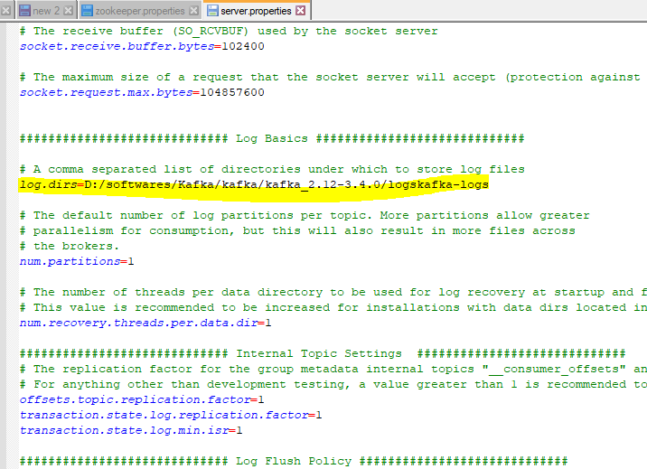
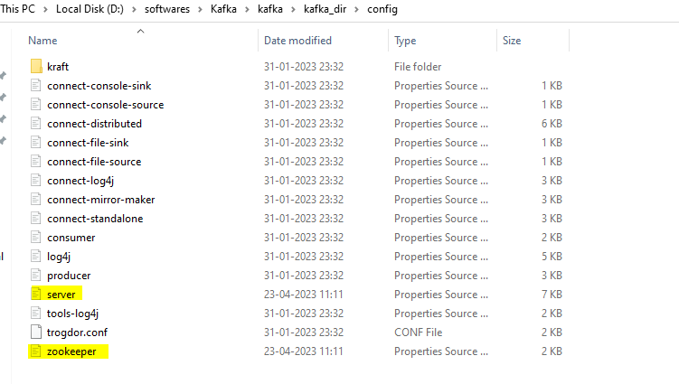
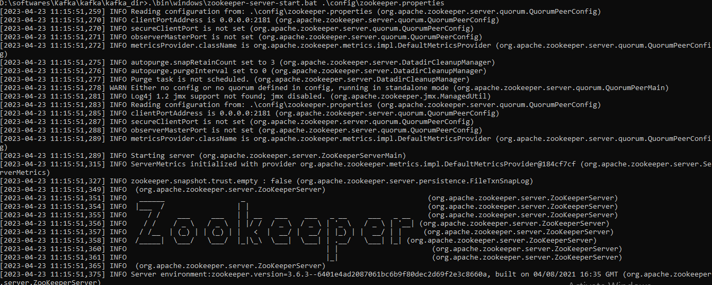
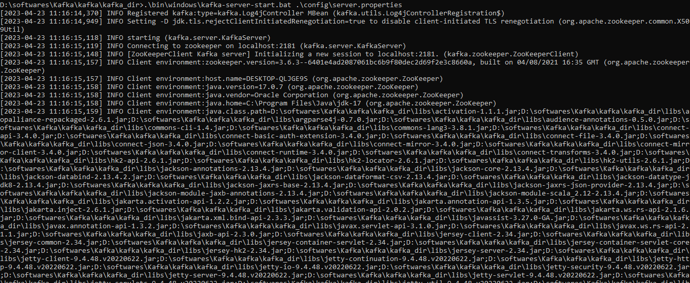
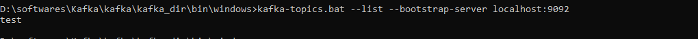
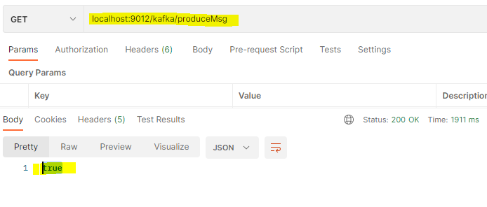

# Kafka

Kafka steps:
1. install kafka from following link:
   https://kafka.apache.org/downloads
2. We need to modify some configs and properties:
   inside config dir, open zookeeper.properties file and update dataDir path: <not sure if this is required as we have different zookeeper folder now>
   dataDir= <path of kafka with '/' as directory differentiator>/zookeeper-data
   
3. In the same dir, open server.properties and update log.dir:
   log.dir=<path of kafka with '/' as directory differentiator>/kafka-logs
    
    

4. start zookeeper:
   ```agsl
    .\bin\windows\zookeeper-server-start.bat .\config\zookeeper.properties
    ```
   

5. start kafka:
   ```agsl
    .\bin\windows\kafka-server-start.bat .\config\server.properties
    ```
    

6. create kafka topics:
   ```agsl
    kafka-topics.bat --create --bootstrap-server localhost:9092 --replication-factor 1 --partitions 1 --topic test
    ```
   

7. Check topics created list
   ```agsl
    kafka-topics.bat --list --bootstrap-server localhost:9092
    ```
    

8. See live msgs in topic:
   ```agsl
   bin/kafka-console-consumer.sh --bootstrap-server localhost:9092 --topic test --from-beginning
   ```

## ERRORS:
1. __ERROR__ Exiting Kafka due to fatal exception during startup. (kafka.Kafka$)
kafka.common.InconsistentClusterIdException: The Cluster ID OXY59REORCCwZu1JD0j-wA doesn't match stored clusterId Some(SVqEzqpYTSKqC3FfbZs5yg) in meta.properties. The broker is trying to join the wrong cluster. Configured zookeeper.connect may be wrong.
    <br>
    __Solution:__
   delete all logs from following folders:
   D:/softwares/zookeeper/apache-zookeeper-3.8.1-bin/data
   kafka-logs
   zookeeper-data


## KAFKA PRODUCER
dependency:
```java
  <dependency>
      <groupId>org.springframework.kafka</groupId>
      <artifactId>spring-kafka</artifactId>
  </dependency>
  <dependency>
      <groupId>org.springframework.kafka</groupId>
      <artifactId>spring-kafka-test</artifactId>
      <scope>test</scope>
  </dependency>
```

1. We need to create a bean of KafkaTemplate which takes a parameter of ProducerFactory in its constructor.
2. This ProducerFactory we can create as following:
   ```java
   @Configuration
   public class SpringKafkaProducer {

       private static final String KAFKA_BROKER = "localhost:9092";
   
       @Bean
       public ProducerFactory<String, Employee> kafkaProducer() {
           Map<String, Object> config = new HashMap<>();
   
           config.put(ProducerConfig.BOOTSTRAP_SERVERS_CONFIG, KAFKA_BROKER);
           config.put(ProducerConfig.KEY_SERIALIZER_CLASS_CONFIG, StringSerializer.class);
           config.put(ProducerConfig.VALUE_SERIALIZER_CLASS_CONFIG, JsonSerializer.class);
   
           return new DefaultKafkaProducerFactory<>(config);
       }
   
       @Bean
       public KafkaTemplate<String, Employee> kafkaTemplate() {
           return new KafkaTemplate<>(kafkaProducer());
       }

   }
   ```
3. We have created a sample GetMapping which will create a sample Employee Object and send it to kafka
   ```java
   @RestController
   @RequestMapping("/kafka")
   public class KafkaProducerController {
       @Autowired
       KafkaTemplate<String, Employee> producer;
       @GetMapping("/produceMsg")
       public boolean sendEmployee() {
           Employee e = Employee.builder()
                   .eId(1)
                   .eName("Snehal")
                   .dept("Devops")
                   .build();
           producer.send("test", e);
           return true;
       }
   }
   ```
   ___producer.send("test", e); here test is the topic name___
4. ScreenShots :
   

   